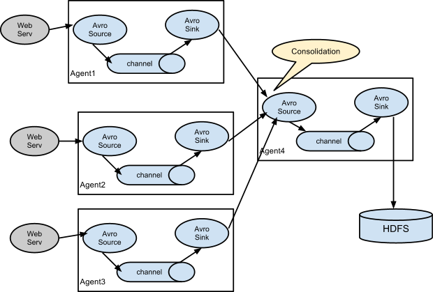
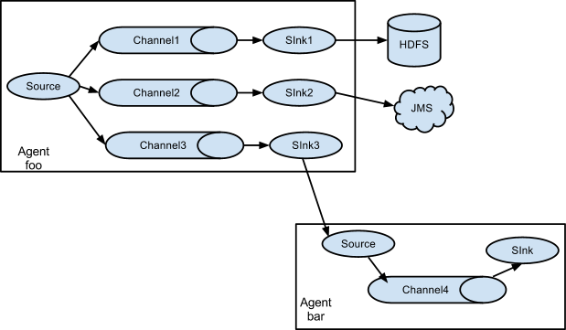
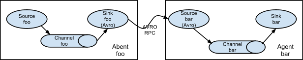

#Flume

@(大数据)

***Apache Flume是一个分布式用于从许多不同数据源收集或移动大量日志文件到集中存储设备的系统***
Flume不只可以用于日志数据的聚合，也可以被用于业务数据、影视数据的处理等上面。
Flume现在分两条线，0.9.x版本和1.x版本，现在flume也是Apache的顶级项目了。本文基于Flume1.6版本。

###Data Flow Model

一个Flume event是定义好的一组字节或字符串
Flome Source是消费外部source（类似Web server）传递过来的事件。外部source使用Flume Source可识别的格式发送事件给Flume，然后Flume Source将接收的事件存入一个或多个Channel，Channel是被动存储——等着被Flume Sink消费。File channel是一种，就是把channel数据备份到本地文件系统。Flume Sink将数据从Channel读取出来写入外部存储系统（例如HDFS），然后从channel中将其删除。
Flume允许用户创建多条通道（可以串行也可以并行），使用多个Agent来传送事件，从extern source到destination。
如果channel是会被存储到本地文件系统而不只是in-memory，则就可以recovery from failure。
###Agent 配置
Agent需要配置source、sink、channel的属性，每一个component（source、sink or channel）在flow中都有名字、类型（例如：source格式是Avro，需要hostname或ip等；sink是hdfs等；channel是memory，则需要容量大小等）。
Agent需要知道每个component加载什么，如何连接，从而组成一个flow。这个就需要列出agent中每一个source、sink和channel的名字。例如：一个agent flows事件从叫做avroWeb的Avro source到叫做hdfs-custer的HDFS sink，通过叫做file-channel的文件 channel。这个配置文件包含这些components的名字，并且file-channel作为source和sink的共享channel。
####启动agent
`bin/flume-ng agent -n $agent_name -c conf -f conf/flume-conf.properties.template`
agent上将启动source和sink（配置文件中配置的），channel不同，就是个资源
一个简单的配置文件作为例子：
`
    #Name the Components ont this agent
a1.sources = r1    
a1.channels = c1  
a1.sinks = k1  
 #configure the source  
 a1.sources.r1.type = netcat  
 a1.sources.r1.bind = localhost  
 a1.sources.r1.port = 4444  
 #configure the sink  
 a1.sinks.k1.type = logger  
  #use the channel which buffer events in memory  
  a1.channels.c1.type = memory  
  a1.channels.c1.capacity = 1000      #如果爆仓了会怎么样？  
  a1.channels.c1.transactionCapacity = 100  
   #bind the source and sink to the channel  
   a1.sources.r1.channels1 = c1  
   a1.sinks.k1.channels1 = c1  
   #a1是这个agent的名字  
`
可以使用下面命令来启动flume（使用上面的配置）：
`bin/flume-ng agent --conf conf --conf-file example.conf --name a1 -Dflume.root.logger=INFO,console`

#####可以配置多个flow到一个agent：
`a1.srouces = source1 source2`
#####可以配置一个source到多个channel
`<Agent>.sources = <Source1>
<Agent>.channels = <Channel1><Channel2>
<Agent>.sinks = <Sink1><sink2> #可以配置一个sink对应一个Channel
`
####Consolidation

####Multiplexing the flow

####Setting multi-agent flow

####将flume的配置文件配置到zookeeper
直接将配置文件上传到zookeeper目录上，目录大概如下：
-/flume
   |- /a1  [agent configure file]
   |- /a2  [agent configure file]
然后命令：
`bin/flume-ng agent -z zkhost:2181,zkhost1:2181 -p /flume –name a1 -Dflume.root.logger=INFO,console` flume就跑起来了

###Source
####Sequence source
flume1.6.0配置文件中默认的source type就是`seq`，其主动产生一个计数器来作为source，可以用于测试，配置如下：
`
agent.sources = seq1
agent.channels = mc1
agent.sinks = ls1
agent.sources.seq1.type = seq
agent.sources.seq1.channels = mc1
....
`

