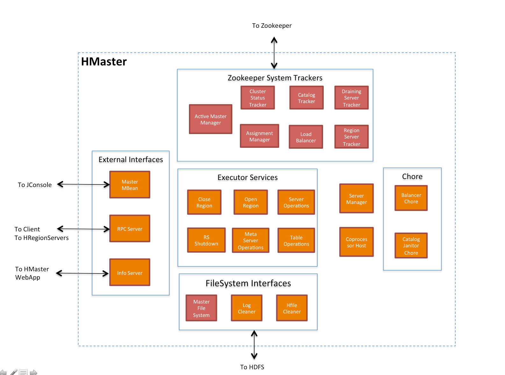

#Hbase
Hbase是一个Hadoop数据库，如果你需要随机、试试读写大数据，HBase可以帮你做到。HBase项目的目标是处理非常大的表——数十亿行和百万列的的表

###Architecture
####Overview
Hbase缺少RDBMS中的第二索引、触发器和高级查询语句
* HBase表通过regions来在集群中分布式存放，随着你的数据增长，region会自动的split和重新分布
* RegionServer自动灾备切换
* HBase支持HDFS作为其分布式存储文件系统
* HBase支持大量MR处理，可以将HBase作为源和目的
* HBase支持使用JavaAPI来处理数据
* HBase支持Thrift和REST API，所以可以支持非Java语言来连接使用
* HBase支持块缓存以及布隆过滤器（Bloom Filter）来使得大量数据查询最优

#####HBase的使用情况
1. 大量数据
2. 不会用到RDBMS的一些额外特性（其实就是HBase无法满足的）
3. 确定有足够的硬件（HDFS少于5个Datanode则不能很好的工作）

#####HBase和HDFS的差别
HDFS是分布式的文件系统，适合存放大的文件，作为一个文件系统，他不提供单独的记录查询。另一方面，HBase是构建在HDFS上，为大表提供快速记录查询。可以这么理解，HBase实质上是把数据组成索引号的存储文件，存储在HDFS上。（HBase+Hive可以通过Impala给替换掉？）
$catalog table:$目录表，HBase的目录表示hbase:meta，作为一个HBase表存在，HBase shell的list命令会过滤掉这个元数据表。

> $-ROOT-:$ 已经在HBase0.96.0中移除掉，所以这里简单说明一下，-ROOT-表记录.META表的位置信息，-ROOT-表结构如下：
> * $Key$ .META region key
> * $Values$ info:regioninfo; info:server; info:serverstartcodei

####hbase:meta
hbase:meta（之前叫做.META.）保存了一个regions的列表，而hbase:meta的位置信息之前是在-ROOT-中记录的，但现在是存在zookeeper中。   
hbase:meta表结构如下：
* $Key$ region key的格式（[table],[region start key],[region id]）
* $Values$ 
	* $info:regioninfo$   region的实例信息，格式为：HBaseInfo类型的序列化
	* $info:server$ 这个region所在的RegionServer的地址，格式为：server:port
	* $info:serverstartcode$ 这个region所在RegionServer开始处理时间

当一个表被拆分时，会增加一行数据包含两列——info:splitA和info:splitB，这两列作为两个子region，这两列的值就是info:regioninfo，等到拆分结束，这行数据就会被删掉。
> HRegionInfo
> key值为空表示一个表的开始和结尾，如果一个region有一个空的key，则这个region是这个表的第一个region，如果这个region有一个空的开始、一个空结尾key，则说明这个表就只有这一个region

####Client
一个HBase客户端通过查看hbase:meta的详细信息获得所需要数据的RegionServers，然后直接从RegionServer处获得数据，而不去和master沟通（和hdfs读数据类似），client会缓存这这些region和regionserver的对应信息以提供子查询，如果master进行负载均衡或一个RegionServer死掉，Hbase客户端需要重新请求Catalog tables，来获得用户region的新位置。

####Master
HMaster是Master Server的实现，HMaster的任务是检测集群中所有的RegionServer和所有metadata接口的变动。在分布式集群中，HMaster一般运行在NameNode上。
HMaster也可以部署多个，通过Zookeeper进行选举产生主的Master
由于HMaster不存储Catalog table，client读取数据也是直接从RegionServer读取，所以HMaster死掉之后系统还是可以稳定运行的，但是Master控制了RegionServer的灾备切换和region split，所以这个稳定也是一小段时间。
$Master架构详见$：[Master的架构](http://blog.zahoor.in/2012/08/hbase-hmaster-architecture/)
Master相关组件：

####RegionServer
HRegionServer用来管理regions，在分布式系统中，RegionServer运行在DataNode上.
Region先写入内存（memstore），一旦memstore写满，它的内容被写入磁盘（增加一个文件），这个动作叫做memstore flush。随着sotre files累计，RegionServer会把它们合并，等到这些操作做完，region包含的数据量就变了，RegionServer根据Split policy，决定是否拆分。拆分前后RegionServer都需要和Master沟通，更新meta。拆分后，实际的存储文件不拆分，而是创建一些连接文件指向原来的文件（这样可以避免拷贝复制数据）

####WAL（Write Ahead Log）
正如上面所说，数据线存入memsotre，然后等到memstore写满，然后flush到StoreFiles，但是在flush之前，RegionServer Clash掉，数据就有丢失的风险，这就是WAL存在的意义，WAL保证了修改的数据可以重新被执行。如果WAL写操作失败，那此次操作就会失败。
通常，一个RegionServer只有一个WAL实例，RegionServer在操作memstore之前，先写入log。
WAL在Hdfs中有个目录/hbase/WALs(0.94之前，存在/hbase/.log中，当时叫做HLog)，每一个region在这个目录下都有一个子目录

###HBase shell
`echo "desc 'tablename'" | hbase shell -n` 可以直接获得tablename表的结构
`create 'table', 'columnfamily'
put 'table', 'column', 'columnfamily', 'value'
` --file.txt
`hbase shell ./file.txt` 可以直接运行file.txt里面的内容

###Data Model
HBase数据的相关模型：
* $Table$ 一个HBase Table由多行组成
* $Row$ HBase的一行由一个Row Key和一个或多个列和列的数据组成，Row按照row-key的字母表顺序排序
* $Column$ 一个Column组成了column family和column qualifier，这两个由$:$分隔开
* $Column Family$ Column Family由于性能原因，物理的组合一组Column和其值在一起，每一个column family有一组存储属性——如：是否可以被缓存到内存，数据如何压缩或它的row key被编码等。一个表中的每一行（row）都有相同的Column Family，所以一个给定的行中的某个column family可能没存储任何数据（这个有点类似传统数据库的列）
* $Column Qualifier$ 一个Column Family会给其增加一个Column Qualifier，用来给给定数据块提供索引，给定一个column family，其column Qualifier可能不同如，可能是`content:html`，也可能是`congent:pdf`。column family一般在建表的时候就制定了，但是column qualifier可以随时指定
* $Cell$ 一个cell是行、column family、column qualifier、值、timestamp的组合
* $TimeStamp$ 每个值都会有一个timestamp，也是这个值额版本信息，默认情况下timestamp就是这个值被写入的时间，但是可以在put的时候指定timestamp。
查看数据时，一般是：`content:html `，这个整体叫做一个`column`，而`content`叫做`Column Family`，而`html`就是`column qualifier`。
####逻辑视图
在概念层面上，hbase的table就是一个稀疏矩阵，每一列就是column family，而由于某些行不存在某些column family，所以这些项就是空的（而由于column实际上在展示时，是一行一行展示（而不是像传统，按照rowid来分，这个row的所有column一行展示），类似下面的表格：
|Row Key|TimeStamp|ColumnFamily contents|ColumnFamily anchor|ColumnFamily people|
|-------|---------|---------------------|-------------------|-------------------|
|r1|st1|  |anchor:col1='cnn'| |
|r1|st2|contents:html='...html'| | |
|r1|st3| | |John Stones|
####物理视图
在介绍ColumnFamily时提到，物理的将一组Column和他们的值组合在一起。上面也提到，由于是个稀疏矩阵，所以存储时按照column family存储，随时可以将一个新的column qualifier（column family:column qualifier)增加到某个column family上：
>ColumnFaimly contents:
>|Row Key|TimeStamp|ColumnFamily contents|
>|-------|---------|---------------------|
>|r1|st2|contents:html='...html'|
像上面逻辑视图中展示的空的Cell，物理视图中就不再包含了，

####NameSpace
namespace是一组相似表的逻辑分组，这个抽象层用来为即将到来的多租户特性提供基础服务，这些特性是：
* $Quota Management$ 限制一个namespace能够消费的资源量
* $Namespace Security Administration$ 为租户提供另一个层级的安全管理级别
* $Region server groups$ 一个namespace/table可以被设定存储到一部分RegionServer上，已达到隔离的效果
 

