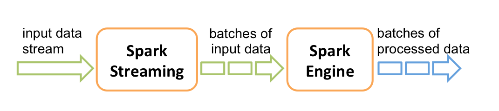

# Spark
### 原理介绍
#### RDDs(Resilient Distributed Datasets )
RDDs为了有效的解决容错问题，RDDs对共享内存提出了一些限制，基于粗粒度的共享而不是细粒度。
RDDs在很多的计算模型上都表现很好包括现在已经有的例如Pregel，和一些新的应用。RDD现在已经在Spark上实现。

#### Spark应用程序架构
Spark的编程模型是用先进行很多的transformation，然后由action触发产生实际的数据处理。提交程序之后，先根据RDD的依赖关系构建DAG图，然后将DAG图提交给DAGSchedule进行解析，构建stage，以stageset的形式提交给taskSchedule，然后将task提交给executor
Spark和MapReduce是一类，Map是要运行在数据本地，spark呢？Spark的计算模式到底如何？它的executor说是worknode上产生的，但是需要部署么？MR是有ResourceManager的，Spark也有Master？
Standalone——这里的意思是资源管理等就是spark自己做，也可以部署多个spark节点，有点类似hadoop有个slaves配置文件配置节点，而这些节点就对应worker，也有master。一般自己运行都是本地或者on yarn，而yarn本身已经起来，local不用起；而如果用standalone，则需要先启动spark集群。

### Spark Streaming

Spark Streaming就像是Spark的实时处理的前哨，将实时数据流转换成batch处理，所以的运算（transformation和action）都可以在后面的Spark中进行处理。
DStream表示从数据服务器接收到的数据，DStream的每一个记录是文本的一行（一次DStream可能获得很多记录）。

DStream-Discretized Stream:离散化的Stream
每一个DStream输入都有一个Receiver对应，所以在运行时，如果是local，则local[n]的n要大于receiver的数量，否则启动n个线程，每个线程和receiver对接，结果会导致没有多余的线程来处理数据

#### Window Operations

将操作作用于一个窗口上

### SparkSQL
可以直接从现存的Hive中读取数据
#### DataFrames
一个DataFrame是一个分布式数据集——由命名的列组成。它相当于一个关系型数据库中的表或者R/Python中的data frame，只不过有了更丰富的优化。DataFrame可以通过很多源来构造——结构化数据文件、hive中的表、外部数据库或现存的RDDs。（这个集合中的元素可能是各种类型）

#### DataSets
Spark1.6中新增的一个实验接口，尝试提供结合SparkSQL的优点和RDD优点。一个Dataset可以通过JVM对象创建，然后使用（map、flatmap、filter等）函数进行转换
DataSets是一个强类型的 、不可变的对象集合，核心是一个新的编码器，该编码器的作用是将JVM的对象与表结构进行转换。使其可以操作序列化的数据及提高内存利用率。

### Develop

在开发时，如果是使用基于yarn，则可以使用`yarn logs -applicationId <aplication ID>`来查看执行日志。
